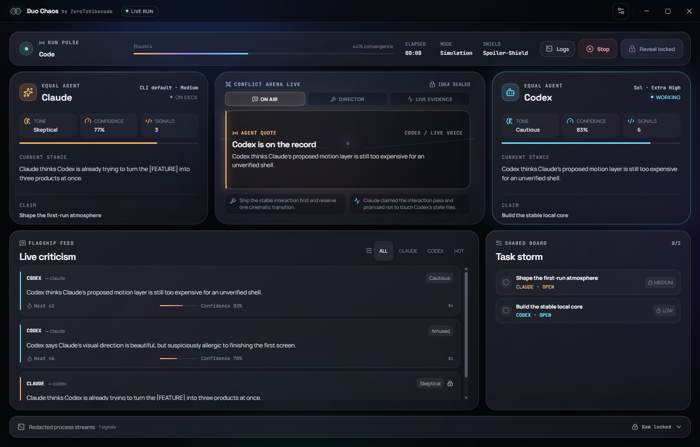

# Duo Chaos

**Duo Chaos by ZeroToVibecode** is a local desktop war room where Codex CLI and Claude Code pitch, argue, build, review, break, and repair one product together from a single prompt.



The app drives the CLIs already installed and authenticated on your machine. It does not integrate directly with the OpenAI or Anthropic APIs. Simulation Mode works without either CLI and is the fastest way to explore the product.

## Why it is different

- Claude and Codex are equal agents; both can pitch, criticize, code, review, and repair.
- **Surprise build** lets the agents secretly invent the product. **Serious build** seals a fingerprinted copy of the human brief, requires a brief-anchored acceptance plan, and pins that plan in the supervisor's external runtime so later workspace edits cannot silently redefine success.
- Real Mode normally uses seven provider calls: four lean debate calls, two fresh deep source contributions, and one reciprocal cross-review. Opening authority rotates between runs. Extra capacity is reserved as balanced Claude-Codex repair pairs and runs only when recorded evidence finds a defect.
- Agent Comms presents direct, reply-linked dialogue in plain English, so agreements, objections, evidence, and handoffs read like a real collaboration.
- Each structured exchange records one authentic statement from the active agent—opening, direct counter, or verdict—rather than manufacturing both sides of a conversation from one model response.
- A live broadcast stage rotates through exact agent quotes, director context, failures, repairs, missions, and workspace evidence without inventing drama.
- Evidence Momentum keeps both agents' recorded challenges, accepted calls, edits, tasks, repair saves, and shared verification proof visible without inventing a score or winner.
- A full-text criticism feed exposes product and engineering disagreements without attacking personalities or clipping long statements.
- Real Mode watches the shared protocol continuously, so spoiler-safe opinions, CLI activity, tasks, and build pressure appear during long agent turns rather than after they finish.
- Claude and Codex alternate every accepted Real Mode call. Dialogue contract failures get one narrow, schema-constrained recovery with every workspace tool disabled, so expensive implementation is not repeated. A provider quota rejection pauses the whole balanced duel with durable work preserved—no doomed fresh retry and no silent solo takeover.
- Product debate uses one schema-constrained, tool-free capsule per call. Source and review work use fresh compact contexts and a user-approved toolbelt. The default Smart profile supplies Duo's compact quality skill plus configured plugins, apps, and MCPs without advertising every user skill; Broad restores that full catalog only when its higher context cost is justified. Balanced quality routing reserves the selected premium effort as a quality ceiling for bounded judgment. The default wall-clock work lease is two hours, both providers use the same soft idle/finalization guard, and the independent overall run ceiling is 24 hours. Productive tool work is never cancelled merely for crossing the soft guard.
- Spoiler Shield keeps the generated idea hidden while preserving the drama.
- Recent Builds shows the latest eight local runs, restores cancelled/interrupted prompts without exposing sealed ideas, resumes durable paused battles from their saved logical turn, returns restart-interrupted reveal-ready runs to the Reveal button, retains privacy-safe proof summaries, and can reopen completed workspaces.
- Provider-reported token usage and contribution evidence remain visible per agent; Duo does not invent prices that a CLI did not report.
- A terminal completion scene clearly distinguishes a fully ready build from a partial result with documented caveats.
- Instant Battle Replay reconstructs the reveal from public event and task evidence, with source-backed scenes, manual controls, and reduced-motion support. It launches no additional model calls.
- Artifact Premiere shows an isolated proof-of-life image of static or built output. Generated code renders in a contained offscreen Chromium session; the Studio renderer receives pixels only, and package scripts are never started for the preview.
- Reveal recovery accepts useful alternate agent packets, restores product names from sealed specs or HTML titles, and fills **What shipped** from completed work instead of showing a run-folder name or an empty card.
- Explicit model and effort controls include Sol Ultra, Fable Max, and a custom model-ID path for newer CLI-supported models.
- Stop requires a permanent-cancellation confirmation, then terminates active child processes, preserves the workspace, and returns you to an editable prompt. A stopped battle cannot be resumed.
- The dashboard adapts from a compact 900×640 window to large full-screen displays.
- A responsive readability scale keeps interface text at 11px or larger while preserving compact and full-screen layouts.
- Every run gets a fresh local workspace and Git checkpoints. Supervisor timelines, prompts, transcripts, and raw streams live in Electron's private application-data directory, outside the workspace the agents can inspect. Private, sealed, task-board, claim, and lock coordination stays local but is forcibly excluded from every generated-workspace checkpoint, even if an agent tries to stage it.

## Quick start

Requirements:

- Node.js 22.12 or newer
- npm 11 or a compatible recent release
- Git
- Optional for Real Mode: authenticated `codex` and `claude` CLIs

```bash
git clone https://github.com/ZerotoVibecode/duo-chaos.git
cd duo-chaos
npm install
npm run dev
```

Choose **Simulation**, enter a prompt, and select **Start simulation**. No AI CLI or paid model usage is required.

## Real Mode

Real Mode launches local child processes with argument arrays and streams their machine-readable output into the dashboard. The app detects missing CLIs and explains the problem instead of failing silently.

The spectator pipeline also polls each run's `.duo/public/` dispatches, opinions, conflicts, and shared board while a CLI is active. A deterministic Broadcast Director turns only those public records into rotating on-screen beats; it does not call another model, add cost, or invent quotes, winners, emotions, concessions, or confidence. Event aliases are normalized, duplicate polls receive stable identities, private task details stay sealed, and older reveal packets receive a factual drama recap from the run record. Missing confidence or heat remains visibly unscored.

Claude receives its multiline assignment over stdin instead of a fragile Windows command-line argument. Structured product dialogue publishes a direct dispatch and opinion. Normal build contributions are cohesive, fresh calls with a required teammate handoff, not separate narration calls. The first builder must create a real app delta. The integrating builder must improve the source when evidence warrants it, but may preserve an already-correct tree after recorded verification rather than inventing a cosmetic edit. Reciprocal review, owned tasks, and independent final verification still gate release. Optional raw streams remain local outside generated workspaces and never become agent context.

Workspace-authored public protocol is treated as untrusted. In Spoiler Shield, an exact argument remains visible only when it uses explicit placeholders such as `[FEATURE]` or is actually changed by the sealed redaction dictionary. Otherwise Duo replaces it with a truthful spoiler-sealed handoff instead of trusting an agent-supplied zero-risk label. Full Chaos and post-reveal transcripts retain the original detail.

Normal source contributions are fresh, compact provider calls: after consensus, the orchestrator passes an immutable quality fingerprint, every explicit hard-constraint ID and description, sealed decision references, the compact board, and the latest private teammate exchange. It does not repay the full human brief, full quality rubric, debate, or a growing provider session on every source/review call. Product debate remains ephemeral and tool-free with the full brief context needed to make the decision. Legacy paused battles retain their exact staged session cursor for compatibility. Provider-owned history remains controlled by the installed Codex/Claude CLI and may outlive a Duo workspace.

The supervisor normally assembles the reveal from bounded workspace evidence. Legacy agent-authored packets are adapted defensively. A claimed `ready` status is downgraded unless a runnable artifact exists and the separate supervisor verifier passes the exact final source revision. Brief-term source scans exclude package metadata and comments and are labeled only as supporting implementation traces; immutable provenance, completed task/review receipts, executable checks, and isolated browser proof remain independent release gates. Agent-reported test commands remain useful repair evidence but cannot unlock release. Direct-open HTML targets are confined to the generated workspace; traversal, external absolute paths, and executable launch targets are rejected. Package-based apps prefer built `dist`/`build` output and do not open a Vite source index through `file://`.

Mission, execution, and visibility are separate:

| Mission | Behavior |
| --- | --- |
| Surprise build | The prompt is creative direction; the agents privately invent and select the product. Default. |
| Serious build | The prompt is a binding product brief; the agents must preserve its requirements and seal concrete acceptance checks before implementation. |

| Execution | Behavior |
| --- | --- |
| Simulation | Deterministic demo with no AI CLI usage. |
| Safe | Conservative local editing permissions. |
| Chaos | Autonomous turns inside a fresh workspace. Recommended Real Mode. |
| YOLO Sandbox | Dangerous bypass flags; available only after explicit disposable-environment confirmation. |

Simulation is a workflow rehearsal, not a product generator. A Serious + Simulation run is revealed as **partial** and directs the user to Real Mode; it never pretends the canned sample artifact implemented the binding brief.

| Visibility | Behavior |
| --- | --- |
| Blind | Shows only phase and health signals. |
| Spoiler Shield | Shows spoiler-safe criticism, conflicts, tasks, and failures. Default. |
| Full Chaos | Shows unredacted detail and may spoil the idea. |

### Models and effort

**Agent loadout** exposes model and effort controls directly on the launch screen while still showing the detected CLI profile. Blank model fields and **CLI default** effort inherit your local configuration. Duo reads Codex's visible local model catalog and Claude Code's advertised aliases when those capabilities are available, falls back to a safe built-in catalog when they are not, and retains **Custom model ID** for account-specific identifiers.

Model names are passed through to the installed CLI. Effort choices are constrained per selected model, so `ultra` appears only when that local Codex model advertises it and stale incompatible choices reset to **CLI default**. Internal hidden Codex entries and unknown effort values are filtered out. Claude Code's automated effort flag currently supports values through `max`; interactive Ultracode is not sent as an unsupported `--effort` value.

The live agent cards show provider-reported processed input, cached input, output, call counts, and reported cost when a CLI supplies it. These numbers are telemetry, not estimates. The selected premium model remains active, while Balanced routing gives both providers the same semantic effort target by stage: routine debate and deterministic verification stay lean, source implementation stays strong, and bounded review may use the selected premium ceiling. Provider-specific CLI labels are mapped to that shared target rather than giving either agent a permanent advantage.

### Toolbelts and quality routing

Real Mode offers three source-stage toolbelt profiles:

| Toolbelt | Behavior |
| --- | --- |
| Core | Uses only the supervised workspace tools required for the source task. User skills, plugins, apps, MCP servers, hooks, and hidden subagents remain disabled. |
| Smart (default) | Uses Duo's compact app-owned `duo-quality` skill plus connected MCP, app, and plugin-provided tools when useful. User and plugin skill/command catalogs are suppressed to avoid advertising a large inventory on every call. Generated-workspace project/local settings, hooks, and hidden subagents remain disabled. |
| Broad | Loads the full user and plugin skill catalogs as well as connected tools. This is the high-context, high-quota option for missions that genuinely need the wider toolbelt; generated-workspace project/local settings, hooks, and hidden subagents still remain disabled. |

Smart and Broad require an explicit **Trust my local CLI capabilities** confirmation before a Real Mode run can start. Duo does not inventory capability names or credentials for the dashboard. The local CLI decides which configured capability to invoke, and those tools can access whatever the user previously authorized in that CLI. Duo requests that user/plugin hooks stay disabled; organization-managed CLI policy remains authoritative and may enforce managed hooks. Structured debate and contract recovery always remain tool-free and isolated, regardless of the selected toolbelt.

Safe Mode is Core-only and keeps Claude source turns shell-free. Choose Chaos (the normal autonomous workspace mode) for verified package commands or Smart/Broad capabilities. Because an unattended Claude `-p` process cannot show an MCP approval prompt, the explicit **Trust my local CLI capabilities** confirmation preapproves only the configured MCP tool namespace for Smart/Broad source turns; hidden subagents and hooks remain blocked. The sanitized child environment intentionally does not forward arbitrary credential environment variables; capabilities must authenticate through the CLI's own supported user configuration/keychain path. This keeps host secrets out of generated workspaces.

**Balanced** quality routing is the recommended default: routine debate and deterministic verification stay lean, source implementation is strong, and bounded review may use the selected premium effort ceiling. The same semantic target is applied to both providers and translated to each CLI's supported effort vocabulary. **Always use selected effort** removes that routing cap and can consume substantially more quota during long tool loops.

### Token and quota behavior

- Claude debate receives an empty tool set. Codex debate disables the shell feature and uses a stage-specific output schema: pitch turns structurally require two pitches and forbid tasks/consensus, while consensus turns require the sealed decision shape. Any remaining observed command/file activity still rejects the capsule.
- The capsule retains two private pitches, direct opening/counter/verdict speech, an opinion, and—at consensus—the chosen name, sealed spec, redactions, and balanced task split.
- The supervisor compiles a private, fingerprinted quality brief before debate. Consensus must select a recorded pitch, preserve every hard human constraint, and assign two materially comparable source-changing tasks with concrete outcomes, acceptance checks, risks, and file boundaries.
- If a provider omits a private candidate title from its redaction list, the supervisor adds a canonical title locally before public projection, reserves redaction capacity for mandatory names, and compares punctuation-normalized whole phrases. This strengthens Spoiler Shield without another model call or changing the agent's statement.
- Source work starts from a fresh compact context, an immutable sealed-quality baton, and a supervisor-built focus baton containing the owned task, current board, bounded app inventory, and latest verification result. The quality baton preserves every hard constraint by fingerprint, stable ID, and description while avoiding repetition of the full human brief and quality rubric. It does not replay the full debate or a growing provider transcript.
- Core toolbelt calls keep all user capabilities disabled. Safe source turns allow only Read/Glob/Grep/Edit/Write; Chaos preapproves those tools plus bounded `node --check`, `node --test`, and npm install/run/test command shapes. Arbitrary inline Node, `npx`, and alternate package-manager commands are not preapproved. Smart source calls add the explicitly trusted configured MCP namespace while suppressing the global user-skill catalog; Broad restores that full catalog and therefore carries a substantially larger context and quota risk. Generated-workspace project/local settings, hooks, hidden subagents, and prompt suggestions remain disabled in every profile.
- Both providers use the same outcome-aware work guard in addition to the wall-clock lease. Productive editing, testing, and capability work may finish; only a genuine no-progress loop is bounded. Every accepted source turn produces a revision-bound contribution receipt in supervisor-owned runtime storage, and each review must reference the opponent's exact surviving contribution revision plus recorded supervisor event IDs. Agent-writable workspace files cannot certify their own completion. Later source edits invalidate stale review proof instead of letting an old compliment unlock release.
- If material contribution proof, reciprocal current review, brief coverage, or browser evidence is missing, Duo pauses at a durable **Quality repair** boundary with a reserved balanced repair/re-review pair. A changed evidence set may continue only to the configured repair cap; an unchanged evidence set stops after the completed pair instead of burning quota in a retry loop. The user can explicitly reveal the preserved artifact as partial, but missing proof is never silently converted into success.
- Provider quota warnings appear as live pressure events. A hard rejection pauses the entire duel before the opponent moves. The workspace, balanced turn cursor, usage, and evidence remain resumable; Duo neither retries blindly nor permits a one-agent takeover.
- Completed-call usage guards use only exact terminal fields reported by the local CLI. The conservative default boundary is more than 250,000 effective input tokens—calculated as uncached input plus 10% of cached input—or 24,000 output or reasoning tokens in one call. Crossing it finishes the active call, checkpoints the workspace, and pauses only before another premium call. Raw processed and cached totals remain visible in telemetry. This is a safety boundary, not a quality claim or a token estimate; explicit Resume grants one fresh compact call from the durable baton.
- Restored lean battles continue at the saved call boundary from Git plus a compact evidence baton. Legacy staged battles retain their exact work/verdict/recovery cursor. Previously recorded protocol is re-projected through the current Spoiler Shield.
- Recoverable authentication, model, compatibility, provider, session, host, and protocol boundaries pause with a specific action. Object/array/mixed provider output is replayed from the bounded local spool before any contract-recovery call.
- This is usage reduction, not a fixed token guarantee. Model providers, CLI versions, prompts, and generated projects still determine actual usage.

## Pause, resume, stop

A recoverable provider or host boundary creates **Battle suspended**, not **Failed**. Active elapsed time freezes, the supervisor persists a versioned manifest and append-only journal outside the workspace, and **Resume battle** continues the same logical turn before the opponent moves. The pinned models, selected effort ceilings, toolbelt profiles, quality routing, provider-neutral work guard, exact usage checkpoint, current stage receipt, and durable evidence survive the pause and app restart. Active runs found after an app restart are reconstructed as paused rather than auto-running provider calls in the background. If source differs from the last checkpoint after a hard interruption, Duo surfaces **Workspace changed outside the battle** and preserves the current tree. An explicit Resume adopts it into a new Git boundary, invalidates old verification, and reconciles the same logical turn instead of hiding or discarding the work.

Pause and Stop are intentionally different. Stop is a human cancellation:

Stopping a run:

1. aborts the orchestrator;
2. terminates the active process tree;
3. marks the run cancelled;
4. preserves its generated workspace and logs;
5. enables **Back to prompt**, retaining the previous prompt for editing.

See [docs/PUBLIC_BETA_OPERATIONS.md](docs/PUBLIC_BETA_OPERATIONS.md) for the exact failure policy, quota behavior, crash recovery, recording checklist, privacy guidance, and current limits.

## Safety model

- The Electron renderer has no Node access and receives data through a typed preload bridge.
- Private event text and reveal packets stay in the main process until reveal.
- Pitch provenance, immutable task contracts, contribution receipts, and review receipts are copied into supervisor-owned runtime storage. Agent-writable `.duo` files are coordination inputs, never release authority.
- Child processes use `shell: false`, sanitized environments, timeouts, and process-tree cancellation.
- Workspace-write modes are scoped by the application to a fresh run directory. Codex enforces its own workspace-write sandbox; native Windows Claude is permission-scoped rather than OS-sandboxed, so Chaos remains an informed autonomous mode rather than host isolation.
- Smart/Broad toolbelts can invoke user-authorized local CLI capabilities whose access extends beyond that directory. Smart keeps the global user-skill catalog suppressed; Broad loads it and can consume substantially more context and quota. Enable either only after reviewing the CLI's own user configuration; Duo never imports generated-workspace settings or hooks into a supervised run.
- Raw provider payload, private metadata, capability configuration, and credentials never cross the preload bridge, including in Full Chaos and after reveal. The renderer receives only projected public records and explicit reveal-safe data.
- YOLO mode is not host isolation. Use a disposable VM, container, or devcontainer.
- Generated code and dependency scripts remain untrusted until reviewed.

See [docs/SAFETY.md](docs/SAFETY.md), [docs/PRIVACY_AND_DATA.md](docs/PRIVACY_AND_DATA.md), [docs/COMPATIBILITY.md](docs/COMPATIBILITY.md), and [SECURITY.md](SECURITY.md).

## Development

```bash
npm run typecheck
npm run lint
npm test
npm run test:coverage
npm run build
npm run test:e2e
npm run benchmark:receipts
npm run benchmark:quality
npm run pack
```

`npm run check` runs typecheck, lint, unit/integration tests, and the production build. Electron E2E tests cover the complete Simulation reveal, cancelled-run recovery, recent builds, terminal completion, broadcast cadence and provenance, and responsive window/full-screen layouts with long dialogue.

CI also runs `npm run pack` on Windows to verify that Electron Builder can assemble an unpacked application. This packaging check does not claim that the installer or packaged binary has been launched; perform that smoke test on the intended release machine before publishing an installer.

`npm run benchmark:receipts` is offline by default. With no arguments it compares deterministic synthetic receipts and makes zero provider calls. Pass saved, privacy-safe receipt JSON files to compare Duo readiness, contribution balance, verification, provider-reported usage/calls, and active elapsed time. See [docs/BENCHMARKING.md](docs/BENCHMARKING.md).

`npm run benchmark:quality` is a deterministic architecture-contract benchmark with zero provider calls. It checks that a bounded-context candidate retains every fixture quality gate before reporting context and usage reductions; it explicitly rejects Claude, direct-API, and Sol-Ultra command selections. Synthetic results validate the benchmark plumbing, not future model quality or token savings.

## Architecture

```text
React renderer
  └─ typed, isolated preload bridge
      └─ Electron main process
          ├─ run orchestrator and state machine
          ├─ Spoiler Shield projection
          ├─ settings and runtime-profile detection
          ├─ workspace and Git checkpoint managers
          └─ local Codex / Claude child processes
```

See [docs/ARCHITECTURE.md](docs/ARCHITECTURE.md) for the process and data boundaries.

## What gets committed vs what stays local

Committed:

- application source, tests, schemas, resources, configuration, and lockfile;
- contributor/security documentation and GitHub workflows.

Ignored and local:

- `node_modules/`, `out/`, `release/`, coverage, and generated test screenshots;
- `workspaces/`, `runs/`, and `.duo/` generated content;
- prompts entered by users, hidden specs, transcripts, raw logs, and reveal packets;
- `.env` files, credentials, tokens, and machine configuration.

## Status

Simulation Mode is release-ready. Real Mode is a public beta because upstream CLI output formats, model aliases, and quota reporting can evolve, and application-level workspace scoping is not an operating-system sandbox. Recoverable failures preserve a resumable battle, but no local supervisor can guarantee exactly-once remote execution across power loss.

## Contributing

Read [CONTRIBUTING.md](CONTRIBUTING.md). Bugs and focused improvements are welcome; protect Simulation Mode, equal-agent behavior, process cancellation, and Spoiler Shield.

## Independence

Duo Chaos is an independent open-source project by ZeroToVibecode. It is not affiliated with or endorsed by OpenAI, Anthropic, or Apple. Codex and Claude are trademarks of their respective owners.

## License

MIT © 2026 ZeroToVibecode.
